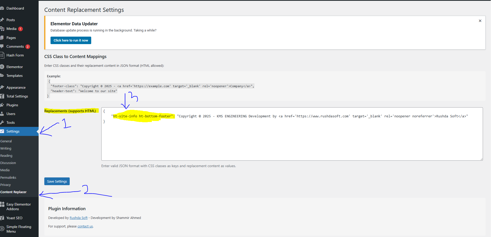
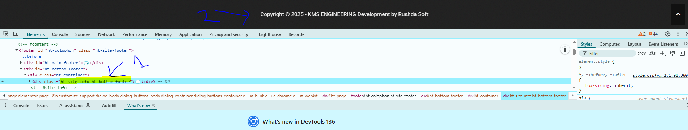

# Class Content Replacer WordPress Plugin

  
*Dynamically replace content in any HTML element by CSS class*

[](https://wordpress.org/plugins/) 
[](https://github.com/shammir-ahmed/class-content-replacer/releases)
[](LICENSE)

## 🔥 Features

- **Target Elements by Class** - Replace content in any HTML element with specified CSS classes
- **Full HTML Support** - Include links, images, and formatted text in replacements
- **JSON Configuration** - Simple admin interface with real-time validation
- **Lightweight** - Vanilla JS implementation (no jQuery dependency)
- **Multisite Ready** - Works across WordPress networks

## 🚀 Installation

### Method 1: WordPress Admin
1. [Download Latest Release](https://github.com/shammir-ahmed/class-content-replacer/releases/latest/download/class-content-replacer.zip)
2. Go to **Plugins → Add New → Upload Plugin**
3. Activate the plugin

### Method 2: Manual (FTP)
```bash
cd /wp-content/plugins/
wget https://github.com/shammir-ahmed/class-content-replacer/archive/refs/heads/main.zip
unzip main.zip

## Admin Interface
 

## How It Works


## Configuration

1. Go to WordPress Admin → Settings → Content Replacer
2. Enter JSON configuration with your class mappings:

```json
{
    "footer-class": "Copyright © 2025 - <a href='https://example.com'>Site</a>",
    "header-text": "Welcome to our website"
}

## License
This plugin is released under the [GPLv2 license](LICENSE).
